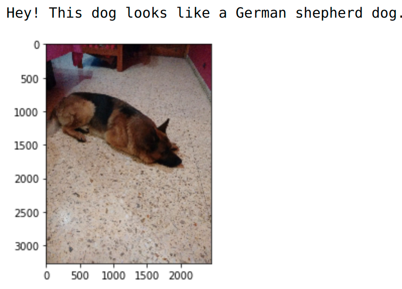
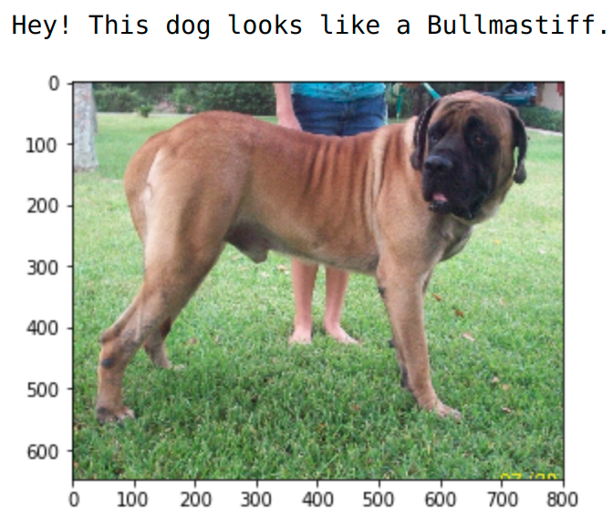
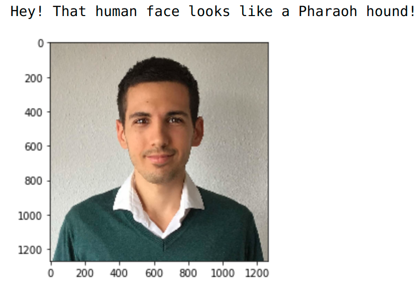
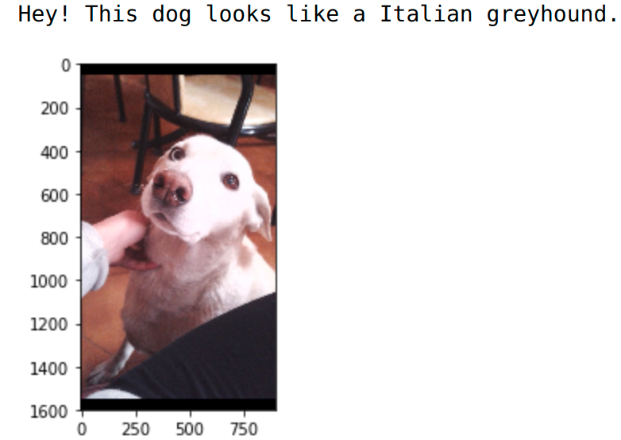

# CNN Dog Breed Classifier Project
[](https://www.udacity.com/course/deep-learning-nanodegree--nd101)
[](https://www.udacity.com/course/data-scientist-nanodegree--nd025)

[//]: # (Image References)

[image1]: ./images/sample_dog_output.png "Sample Output"
[image2]: ./images/vgg16_model.png "VGG-16 Model Layers"
[image3]: ./images/vgg16_model_draw.png "VGG16 Model Figure"
[german-shepherd]: /images/german-shepherd.png
[bullmastiff]: /images/bullmastiff.png
[human-dog]: /images/human-dog.png
[mongrel]: /images/mongrel.png

The project consists of building a classifier that determines the canine's breed given an image of a dog. If the input image corresponds to a human, the model yields the resembling dog breed. The project is composed of the following steps:
* Detect human faces using OpenCV's implementation of [Haar feature-based cascade classifiers](https://docs.opencv.org/master/db/d28/tutorial_cascade_classifier.html). 
* Detect dogs using a [VGG-16 model](https://pytorch.org/vision/stable/models.html#id2) pre-trained on the [ImageNet](https://image-net.org/) dataset.
* Create a CNN to classify dog breeds (from scratch)
* Create a CNN to classify dog breeds (using transfer learning)
* Combine the human and dog detectors to provide estimates of canine breeds of input images:
  * If the image contains a dog, it returns the predicted breed.
  * If the image contains a human face, it returns the resembling dog breed.
  * If the image contains neither a dog nor human, it returns an error.

The following images show examples of the resulting algorithm:

 
 


## Model performance
The Dog Breed classifier achieved a test accuracy of 84% (704/836).


## Project structure
- [dog_app.ipynb](./dog_app.ipynb):
- [dog_breed_classifier.py](./dog_breed_classifier.py):
- [web_app](./web_app.py):

## How to run the web application


## How to run the notebook
1. Clone the repository and navigate to the downloaded folder.

	```
		git clone https://github.com/lmasello/Dog-breed-classifier.git
		cd Dog-breed-classifier
	```

__NOTE:__ if you are using the Udacity workspace, you *DO NOT* need to re-download the datasets in steps 2 and 3 - they can be found in the `/data` folder as noted within the workspace Jupyter notebook.

2. Download the [dog dataset](https://s3-us-west-1.amazonaws.com/udacity-aind/dog-project/dogImages.zip).  Unzip the folder and place it in the repo, at location `path/to/dog-project/dogImages`.  The `dogImages/` folder should contain 133 folders, each corresponding to a different dog breed.
3. Download the [human dataset](http://vis-www.cs.umass.edu/lfw/lfw.tgz).  Unzip the folder and place it in the repo, at location `path/to/dog-project/lfw`.  If you are using a Windows machine, you are encouraged to use [7zip](http://www.7-zip.org/) to extract the folder.
4. Make sure you have already installed the necessary Python packages according to the [requirements.txt](./requirements.txt) file.
5. Open a terminal window and navigate to the project folder, and open the notebook.

	```
		jupyter notebook dog_app.ipynb
	```

__NOTE:__ In the notebook, you will need to train CNNs in PyTorch. If your code is taking too long to run, you will need to either reduce the complexity of your chosen CNN architecture or switch to running your code on a GPU.  If you'd like to use a GPU, you can spin up an instance of your own.

## Acknowledgements
This project contains my implementation of the "Dog breed classifier" project for the Udacity's [Deep Learning program](https://www.udacity.com/course/deep-learning-nanodegree--nd101) and [Data Scientist program](https://www.udacity.com/course/data-scientist-nanodegree--nd025). The baseline code and datasets have been taken from the [Udacity's Deep Learning repository](https://github.com/udacity/deep-learning-v2-pytorch).